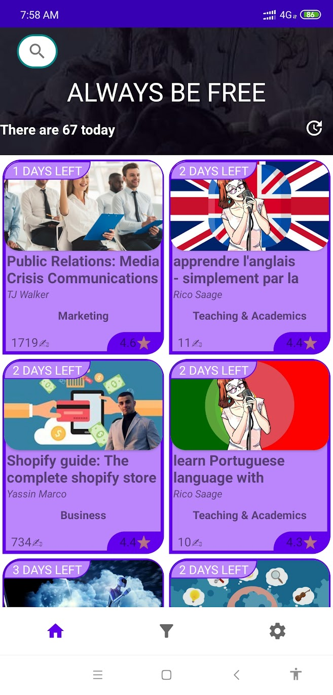
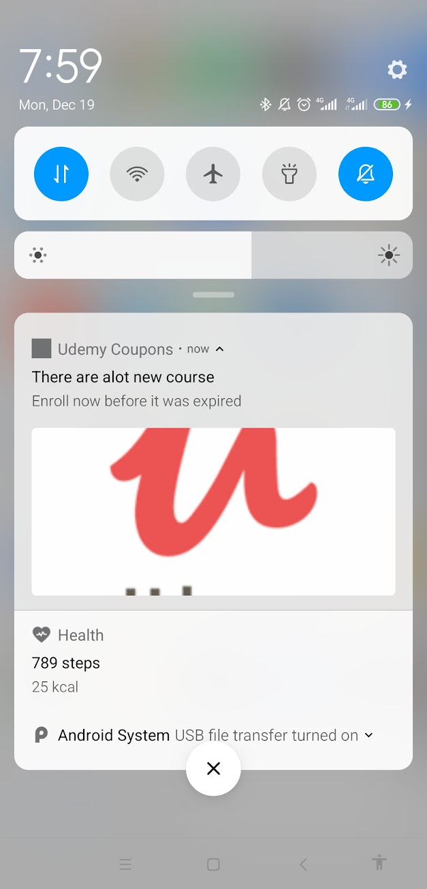
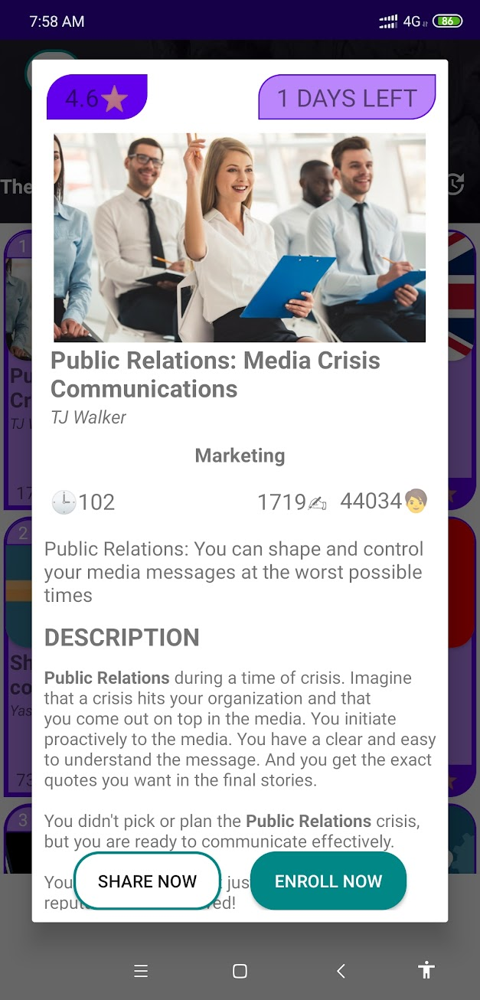
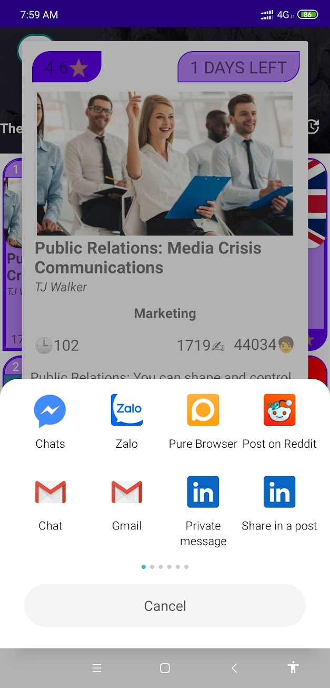
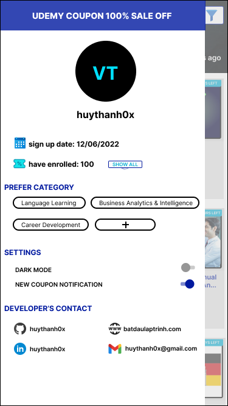
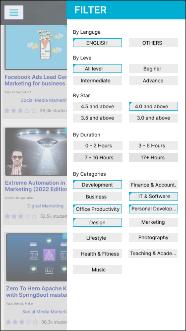

#Simple Fetch client for Udemy coupon
### Feature
This app will fetch a json file from [this source](https://raw.githubusercontent.com/BlogBatDauLapTrinh/crawl_udemy_coupon_real_time/master/udemy_coupon.json)

Show it in a visual format                  |Search for a specific keyword                     |Notification                              
:------------------------------------------:|:------------------------------------------------:|:----------------------------------------:
|  |

Detail info of a spcific course             |Share course                                   |Open in webpage
:------------------------------------------:|:---------------------------------------------:|:---------------------------------------------:
||

### Undone feature

- Filter by preferences
- Settings

### Todo

- Completely change the UI from [this new design](https://www.figma.com/file/XCDEehCTNLdZTuHbQdlzm2/Udemy-Coupon-Android-App?node-id=0%3A1&t=m1wd1WJgXzzPlcAo-0)
- Use new Tech as JetPack Compose instead of XML
- Add cloud storage to store user data (joint courses, number of courses)
- Let user upload new coupon URL
- Add darkmode
- Add user preferences and then push notification base on those
- Quick filter by user preferences

### Screenshot of new design

Home Screen                  |Scroll home screen                     |Search feature                              
:------------------------------------------:|:------------------------------------------------:|:----------------------------------------:
|  |

            
Nav Drawer                                    | Detail info of a spcific course            | Filter feature
---------------------------------------------:|:------------------------------------------:|:---------------------------------------------:
||

